# Individual Responsibility for Sustainability

## Assignment 1: Heuristic Evaluation

Hanna Co | DH110 | Fall 2022

### About the project

There are many sites online that talk about sustainability issues, and discuss root causes. However, a lot of these sites only talk about problems and solutions on a large scale, which often takes responsibility away from the user to take action. Additionally, many of these websites are not user-friendly, which deters viewers from reading further. With these points in mind, I plan to design a site that is more user-friendly and intuitive to use. This site will also detail smaller actions that an individual can integrate into their daily lives in an effort to live more sustainably.

### Jakob Nielson's [10 Usability Heuristics](https://www.nngroup.com/articles/ten-usability-heuristics/) Explained

| Number | Heuristic | Description |
|---|---|---|
| 1 | Visibility of System Status | Users should always be informed about what is going on and should be given appropriate feedback to their actions |
| 2 | Match Between System and the Real World | Use concepts and language that are familiar and logical to the user |
| 3 | User Control and Freedom | Allow users to make mistakes; give them options to undo and redo tasks |
| 4 | Consistency and Standards | Follow conventions and make sure design is consistent across the platform |
| 5 | Error Prevention | Get rid of error-prone conditions and provide users with safety nets for high-cost errors |
| 6 | Recognition Rather Than Recall | Minimize user's memory load by giving them suggestions and help in context |
| 7 | Flexibility and Efficiency of Use | Provide multiple ways to perform a task to make the platform accessible to all users |
| 8 | Aesthetic and Minimalist Design | Provide only relevant content and features |
| 9 | Help Users Recognize, Diagnose, and Recover From Errors | Tell users what the problem is and provide suggestions to fix it |
| 10 | Help and Documentation | Supply users with extra help to complete their tasks |

### [Severity Ratings](https://www.nngroup.com/articles/how-to-rate-the-severity-of-usability-problems/) for Usability Problems by Nielsen Norman Group

The following rating scale can be used to evaluate the severity of usability issues:
| Rating | Description |
|---|---|
| 1 | Cosmetic problem only: need not be fixed unless extra time is available on project |
| 2 | Minor usability problem: fixing this should be given low priority |
| 3 | Major usability problem: important to fix, so should be given high priority |

Ratings are displayed in parentheses after each usability issue.

## Website 1: [UN Environment Programme](https://www.unep.org/)

### About
[UNEP](https://www.unep.org/) is the United Nations Environment Programme, and it sets the agenda for environmental actions and advocates for the environment. This site provides insight into who UNEP is, as well as what they do across the world. As such an authority in sustainability, this site is often visited by users across the globe looking for more information on how we are working to fight climate change. Since so many users visit this site, it is important that it is easy to use, and not overwhelming to one who has no prior knowledge on UNEP.

### Heuristic Evaluation

#### 1. Visibility of System Status
* The site highlights which item on the navigation bar the user is currently looking at. The user's cursor changes when it hovers over clickable links or text boxes.

#### 2. Match Between System and the Real World
* Under the 'Where We Work' section, it's unintuitive why 'North America' and 'New York Office' are separated, and why 'West Asia' and 'Asia and the Pacific' are separated. (2)

  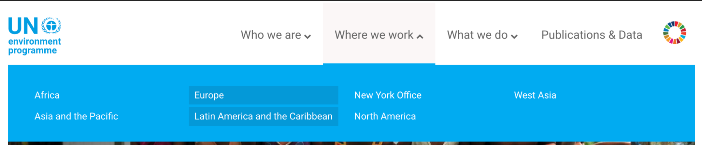

> *Recommendation: Use clearer distinctions between the listed regions, either by listing offices, or countries/continents where they work.*

* The icon on the far right is actually clickable, and takes the user to a site on the UN sustainability goals. Not every user may know that is what this represents, which could potentially be confusing. (1)

  

> *Recommendation: Somewhere close to this icon should be a small subtitle that explains what this represents.*

#### 3. User Control and Freedom
* On some of the links in the navigation bar, it's not clear to the user that clicking the option will open a new tab. In the image below, clicking on UN Environment Assembly, redirects the user to a different webpage, which can make the user feel out of control. (2)

  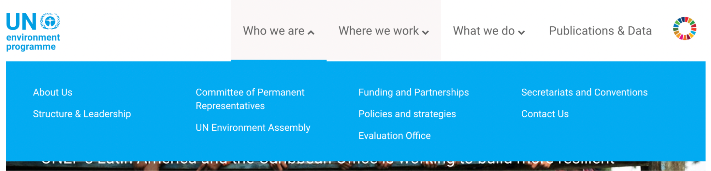

> *Recommendation: There is a commonly used icon to indicate that the link opens in a new tab, which should be used to make that clearer to the user.*

#### 4. Consistency and Standards
* The sub-menu for 'What we do' looks different from all the other sub-menus, as shown below. (2)

  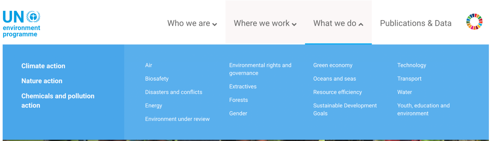
  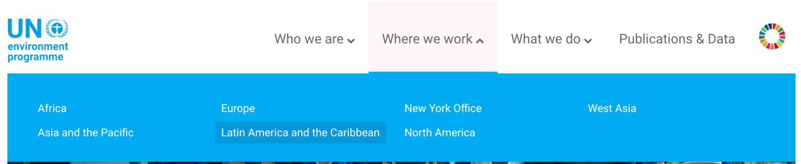

> *Recommendation: The sub-menus should be standardized, and a design chosen that works for both.*

#### 5. Error Prevention
* The search does not support suggestions, making it prone to typos. Additionally, the search does not return similar results, which can be problematic if the user does not know how to spell a word or doesn't notice the type. (3)

  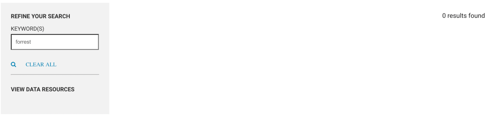

> *Recommendation: We can either suggest results as the user types, or if the word is close in spelling to another commonly searched word, we can return results for that word as well, similar to what Google does.*

#### 6. Recognition Rather Than Recall
* Many of the menu options have sub-menu options nestled within it, forcing the user to recall the organization of the site. (3)

> *Recommendation: Try re-organizing the navigation bar to reduce the number of sub-menu items to a reasonable amount.*

#### 7. Flexibility and Efficiency of Use
* The only way to search is to click the text box and start typing, and press 'Enter' – the magnifying glass is not a functioning icon. (2)

  

> *Recommendation: Allow the user to search by clicking on the magnifying glass.*

* The image carousel shown below is unintuitive to use, because clicking the left button scrolls the images to the right, and vice versa. (3)

  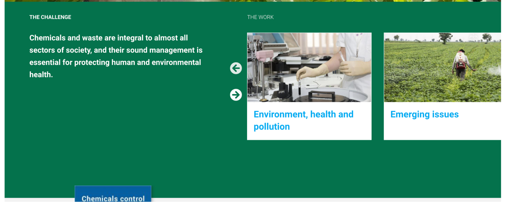

> *Recommendation: Make it so that the button direction matches the scroll direction, which is more intuitive.*

#### 8. Aesthetic and Minimalist Design
* The footer is very long and packed with information, as is the header. It is very overwhelming to look at, especially when the header and footer tend to be more simple and concise on other sites. (2)

  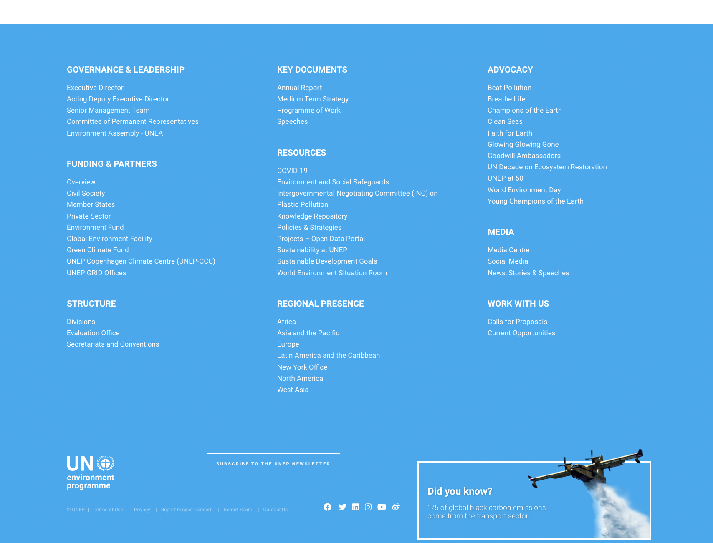

> *Recommendation: A lot of this information can be rearranged to make the design more minimalistic and less overwhelming. The footer in particular should be reduced to just contact and copyright information, instead of being another navigation tool.*

* The site essentially has two navigation bars, which is unnecessary and just causes more confusion for the user. (3)

  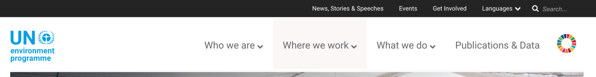

> *Recommendation: Consolidate the information from both of the navigation bars to minimize user confusion.*

#### 9. Help Users Recognize, Diagnose, and Recover From Errors
* To subscribe to their newsletter, it requires the user's email address. However, you are able to submit the form with invalid inputs, and the user is never informed. (3)

  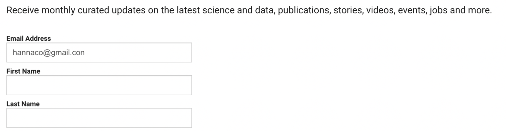

> *Recommendation: The site should perform form validation and display error messages if required fields are missing or have invalid inputs.*

#### 10. Help and Documentation
* Users are able to contact them for help, but there is no guide to help the user navigate the site, and there isn't a FAQ section to answer common questions that one may have. Thus, they may have to wait for a response every time they have a question. (2)

> *Recommendation:  Compile a FAQ and add that as a section on their website, so users have somewhere to look if they need help.*

### Overall Assessment

This site is incredibly information-heavy, and despite having a good balance of images and well-spaced content, it still easily overwhelms the viewer. Its main issue is that the header, footer, and menus contain too much information, which leaves a lot of room for user error. Other than that, it has some minor issues regarding efficiency, consistency, etc.

## Website 2: [Global Environment Facility](https://www.thegef.org/)

### About
[GEF](https://www.thegef.org/) stands for Global Environment Facility, and funds biodiversity and conservation projects across the globe. This site gives insight into who GEF is, and the types of problems they address. The user is also able to take a look at the kinds of projects they work with, and get updates through their 'Newsroom'.

### Heuristic Evaluation

#### 1. Visibility of System Status
* There is no indication that you are on the home page, as you navigate to it by clicking the GEF logo in the upper left. There is no other way to navigate to the home page. (1)

  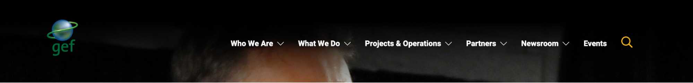

> *Recommendation: Add home as a navigation bar item, and add the same highlighting as the other navigation bar options when the user is on that particular page.*

* They have an interactive chat on the bottom right that allows the user to ask for help. When the user hovers over the text box, the cursor doesn't change, and there is no other indication that the user can start typing their query. (2)

  

> *Recommendation: Change the user's cursor when they hover, and have some indication that the user can start typing.*

#### 2. Match Between System and the Real World
* A lot of the options in the sub-menus have similar meanings, such as the one shown below. This can confuse users, and they may not know which one to navigate to. (3)

  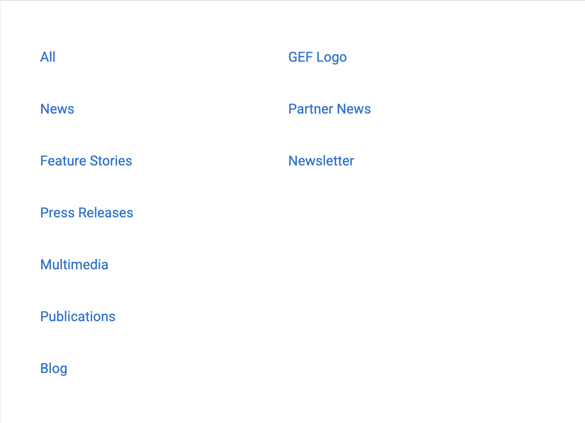

*Recommendation: Remove the options that have similar meanings, such as Newsletter and News.*

#### 3. User Control and Freedom
* The site does not have fast response time, and as a result, the menus often all appear at the time time, especially when the user is looking at them very fast. (3)

  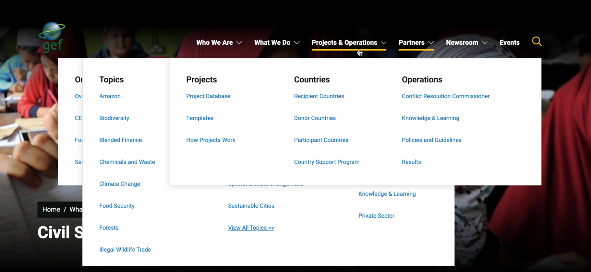

> *Recommendation:  Design a more responsive site to avoid this issue.*

* When the user clicks 'Contact Us', gmail is opened in the same tab, and an email draft is started. This doesn't give the user the feeling of control, as they didn't choose the next action. In addition, if the user decides not to email them, deleting the draft closes the tab, and forces the user to reopen a tab and navigate back to the site. (3)

> *Recommendation: Clicking contact us provides the user with contact information, or opens gmail in a new tab.*

#### 4. Consistency and Standards
* Not every page has the same layout, which is a small issue, but does not look aesthetically pleasing. (1)

  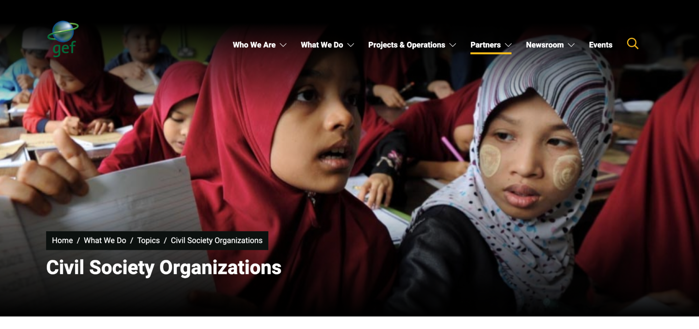
  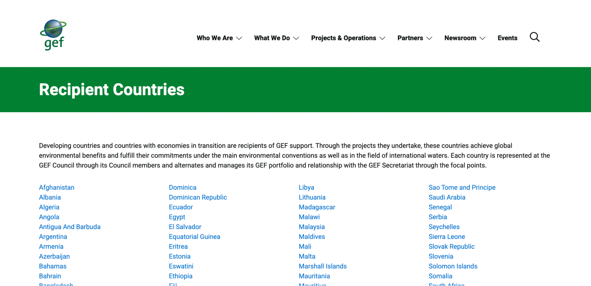

> *Recommendation: Choose one specific layout, and use that across the site.*

* Similarly, the search fields are misaligned, which doesn't affect usability, but doesn't look good. (1)

  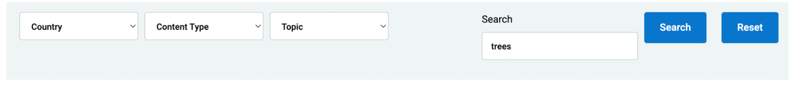

> *Recommendation: Align all the fields and buttons horizontally.*

* In the chat, the typography for the username and password are not the same, which is another minor aesthetic issue. (1)

  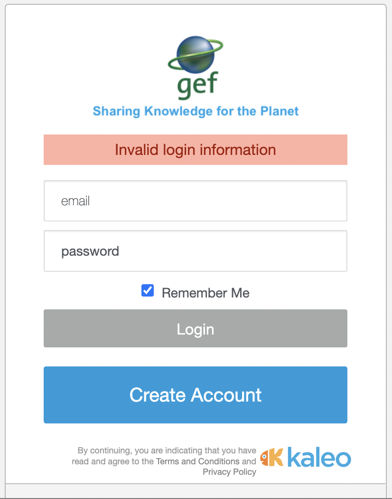

> *Recommendation: Use the same font, color, size and weight for consistency.*

#### 5. Error Prevention
* The search does not support suggestions, making it prone to typos. Additionally, the search does not return similar results, which can be problematic if the user does not know how to spell a word or doesn't notice the typo. (3)

  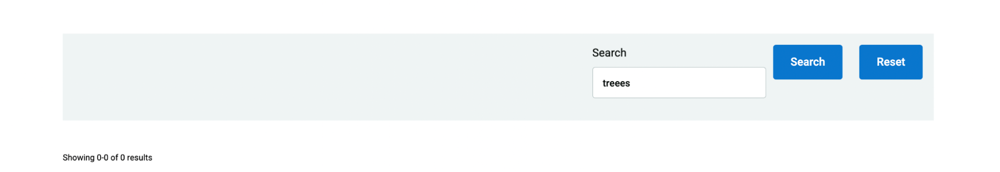

> *Recommendation: We can either suggest results as the user types, or if the word is close in spelling to another commonly searched word, we can return results for that word as well, similar to what Google does.*

#### 6. Recognition Rather Than Recall
* Many of the menu options have sub-menu options nestled within it, forcing the user to recall the organization of the site. (3)

> *Recommendation: Try re-organizing the navigation bar to reduce the number of sub-menu items to a reasonable amount.*

#### 7. Flexibility and Efficiency of Use
* The user is able to search by pressing 'Enter' or clicking the magnifying glass. They can also undo what they type by pressing 'Ctrl-Z'.

#### 8. Aesthetics and Minimalist Design
* A lot of navigation is redundant, as the page has the same navigation options as the menus. (2)

  
  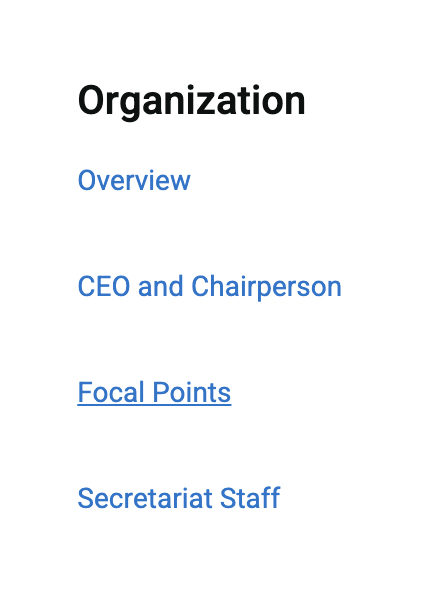

> *Recommendation: Either remove the options from the navigation bar or from the page itself to remove redundancy.*

#### 9. Help Users Recognize, Diagnose, and Recover From Errors
* For login, a generic error message appears, so there is no indication if one of the fields are incorrect, or if they already have an account. (2)

> *Recommendation: Have a clearer error message that gives the user an idea of what went wrong.*

#### 10. Help and Documentation
* Users are able to contact them for help, but there is no guide to help the user navigate the site, and there isn't a FAQ section to answer common questions that one may have. Thus, they may have to wait for a response every time they have a question. (2)

> *Recommendation: Compile a FAQ and add that as a section on their website, so users have somewhere to look if they need help.*

### Overall Assessment

This site has several issues, but most of them are fairly minor aesthetic issues. However, it does have its major usability issues, such as unresponsive menus and too much information provided in one page. It also has a lot of consistency issues that need to be addressed. Overall, the site is usable, and certain pages are easy and appealing to look at and use, but this isn't the case for the entire site.

