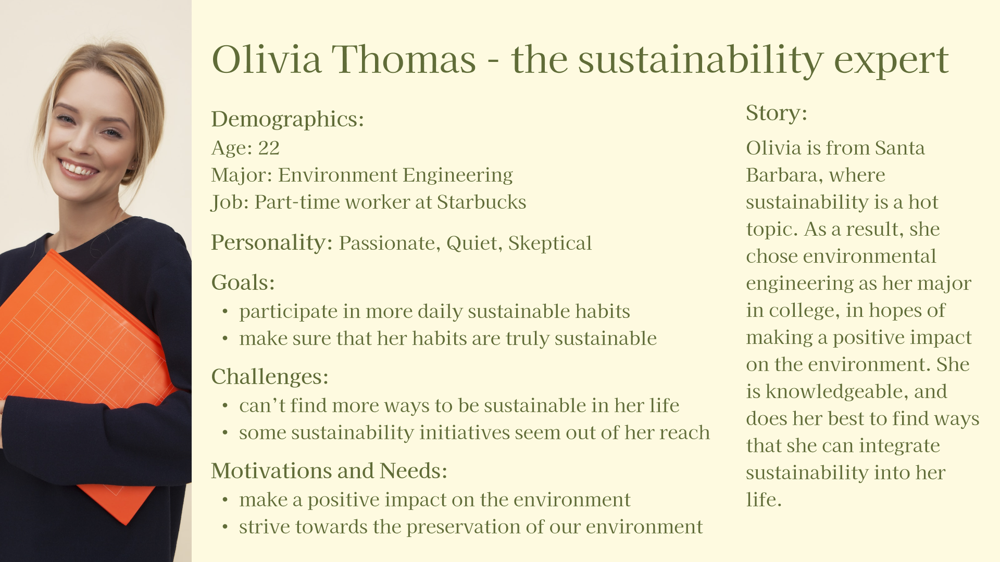
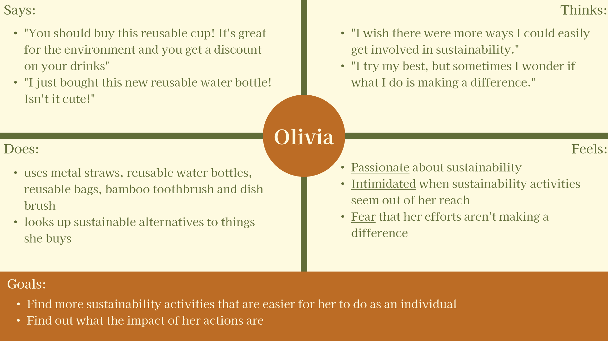
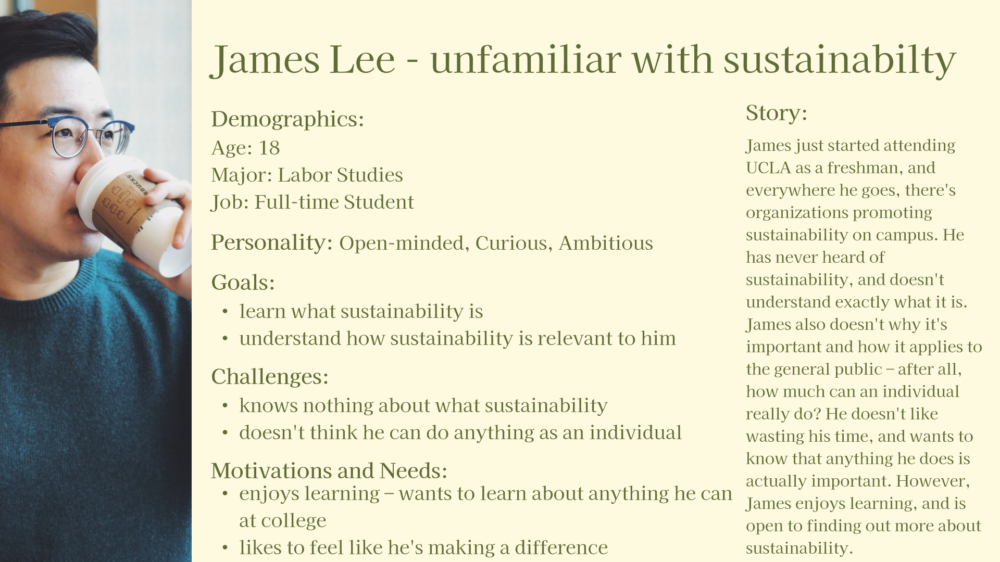
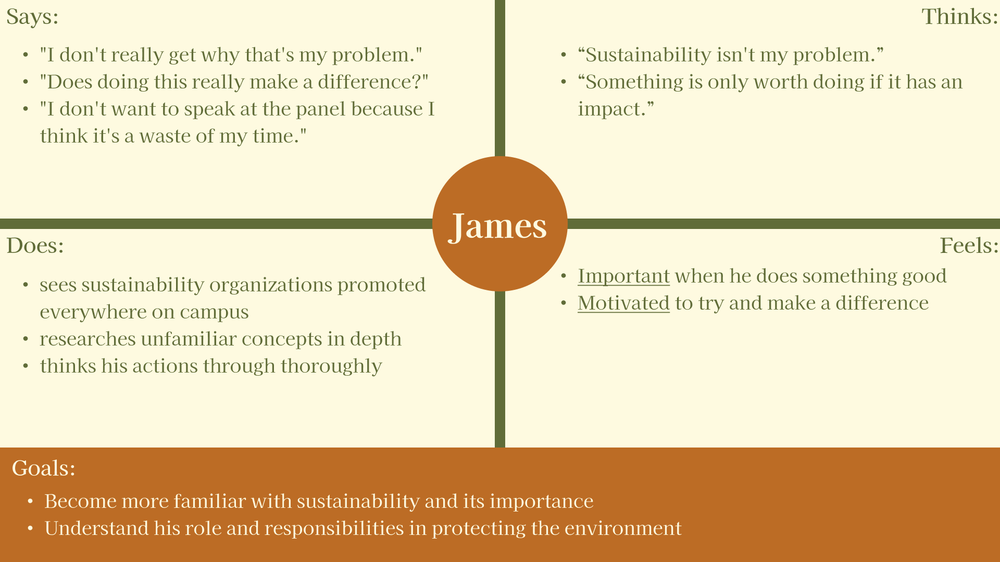
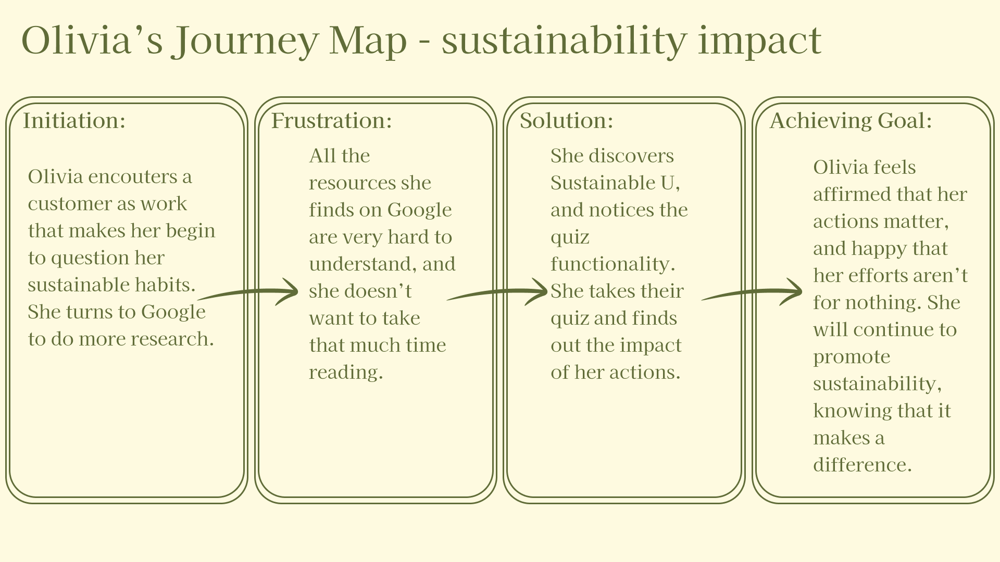
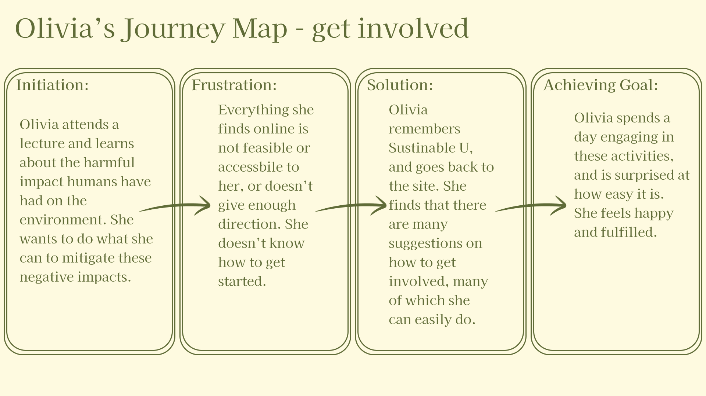
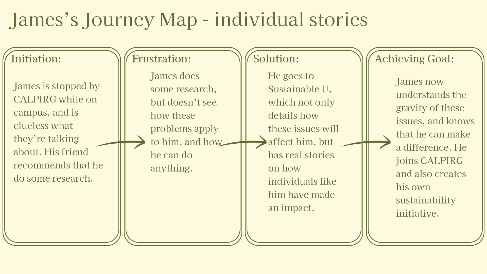

# Assignment 4: Persona and Usage Scenario
Hanna Co | DH110 | Fall 2022

## Purpose of UX Storytelling
The purpose of UX storytelling is to be able to see things from the user's perspective, and allows you to design in a way that takes their needs into account. It allows the designer to focus on the user's goals and motivations, while getting a more general understanding. UX storytelling is less tailored to an individual and allows you to filter out personal preferences or anything that isn't critical to the function and purpose of your design. It's a strategy to help the designer match the product's focus and purpose to the user's needs and goals.

## Design Features
1. Find feasible and accessible ways to be more sustainable
2. Quiz where users can choose sustainable activities they participate in and it tells them what impact it has
3. Read stories about current sustainability issues, how it affects us, and stories from individuals who've made a difference

## Personas & Empathy Map
### Persona 1: Olivia Thomas

### Persona 2: James Lee

## User Scenarios and Journey Maps
### Scenario 1 - Olivia
Olivia is a part-time worker at the Starbucks on her college campus. One day, she is working at the cash register, taking customer's orders. Every customer, she suggests that they buy a reusable cup, to receive a small discount on their drink but to also help the environment. She likes to try and get everyone involved in protecting the environment, even if the effort is small. Usually, they agree or politely refuse, but today, a customer snapped at her, telling her that small efforts like reusable cups are pointless and don't do anything meaningful. Olivia is taken aback and hurt, and begins to feel down. She starts to wonder if anything she's doing is actually helping the environment. She begins to question the real impact of her sustainable habits.

Olivia is unsettled when she goes home, and decides to do some of her own research. Not knowing where to start, she turns to Google as she always does, and begins looking for information regarding her sustainable habits. Unfortunately, all she finds are long articles involving in-depth research and terminology that she is not familiar with. However, after much searching, she finds a website called Sustainable U, which has a quiz that allows the user to select what sustainable activities they participate in, and tells them how their individual efforts have made a difference.

Intrigued, Olivia takes the quiz. She selects all of the sustainable activities that she engages in, such as reusable straws, water bottles, and bags, and taking public transportation. She also inputs how long she has been doing each of these, in order to receive more accurate results. To her delight, the website tells her that her efforts have prevented hundreds of pounds of pollutants in the air, and significantly reduced plastic waste. It also provides her with more specifics: her metal straw usage has stopped 250 plastic straws from being used, which could mean the lives of many marine animals.

Looking at all this information, Olivia begins to feel good about herself again. She is relieved to know that all her efforts weren't for nothing. Not only that, but she was so shocked that just taking the bus every day had such a big impact on pollution. Feeling relieved and affirmed, she continues to participate in her favorite ways to be sustainable, and continues to promote it at her work, now with data to back up her suggestions.

**Olivia's Journey Map**

### Scenario 2 - Olivia
Olivia is enrolled in an Ethics of Environmental Engineering course, which talks about ethical and social issues regarding environmental engineering, as well as other issues regarding the environment. Olivia is attending the lecture, and her professor goes on a tangent and begins to mention all the negative impacts humans have had on the environment. Her professor talks about how trash is accumulating in landfills and in the ocean. Hearing this, she is saddened, but becomes motivated to take action to try and undo the damage that humans have already done.

She goes home and begins to do some research again. She quickly becomes frustrated looking at all these websites run by large organizations – everything they do is not feasible for her to get involved in. They suggest activities or action items such as "reduce carbon emissions" or "fish trash out of the ocean", neither of which are options that are available to Olivia. Some also ask for donations, but Olivia cannot afford to give money to these organizations. She looks at some other websites, but their suggestions are less helpful, with vague reminders and statements that "Earth Day is coming up!" and  "Get involved in National Tree Day!". 

Just when she is about to give up, Olivia remembers Sustainable U, a site she looked at when trying to research the impact of her actions. She navigates back to the site, and is able to quickly find a "Get Involved" tab. Olivia is happy to see that not only does Sustainable U have multiple ways to get involved, but most of them are feasible and accessible for college students like herself. Olivia writes down some of the suggestions, and plans a weekend where she can focus on engaging in these activities.

The weekend comes and Olivia spends the morning cleaning up the local parks and community centers, filling up many trash bags with litter. The work is tiring, but she feels fulfilled and happy. Later in the day, she attends a meeting on the school campus that is petitioning for better trash sorting and more trash bins on campus. She helps them draft a letter to the school and collects signatures for their petition. Olivia ends her day by stopping by the store to pick up more reusable alternatives that she recently learned about. She is surprised at how easy these activities, opportunities, and items were to engage in and find, and is excited to get involved more in the future.

**Olivia's Journey Map**

### Scenario 3 - James
James is on his way to class, and is going through Bruinwalk to get to where his lecture is being held. On the way there, he is stopped by someone who claims to be from an organization called CALPIRG, asking for a donation to prevent plastics in the ocean. He goes on about sustainability, and James is confused and has no idea what he is talking about. James also doesn't really understand how sea turtles dying should matter to him – after all, he's not a sea turtle. He gets to class and tells his friend about his bizarre experience. His friend tells him to do some research and gives him some resources.

James goes home and begins looking at these websites his friend recommended. After reading through the first few, he has a good grasp on what sustainability is, but he still doesn't see how these problems apply to him, especially since there doesn't seem to be anything an individual can do. All these sites that he looked at have talked about things that large organizations have done to make an impact, or just doesn't talk about the impact they've had at all. James wants to know that anything he does as an individual can actually make a difference. He understands that these are problems–dying animals are not good–but still doesn't see how this affects him. James is discouraged, but goes to the last website his friend recommended, called Sustainable U.

He scrolls through, and goes to "Issues", expecting to read the same things he's already read. However, he's surprised to see that these articles break down these issues on each level – how it affects Earth, society, and the individual. After looking at this, he's able to understand that losing a species throws the ecosystem out of balance, and this affects all other living things on Earth, including him. He begins to be intrigued, and clicks on "Read Our Stories", where he finally finds what he's been looking for – articles written by individuals about how the work they've done has made an impact. He reads about how this one guy catches animals on the beach tangled in trash and frees them, effectively saving their life. 

James is content that he finally has answers to his questions, and promises to himself that he will join CALPIRG the next time he sees them, and contribute to more causes that help the environment. He also becomes motivated to start his own initiative on campus to address any issues they can.

**James's Journey Map**

