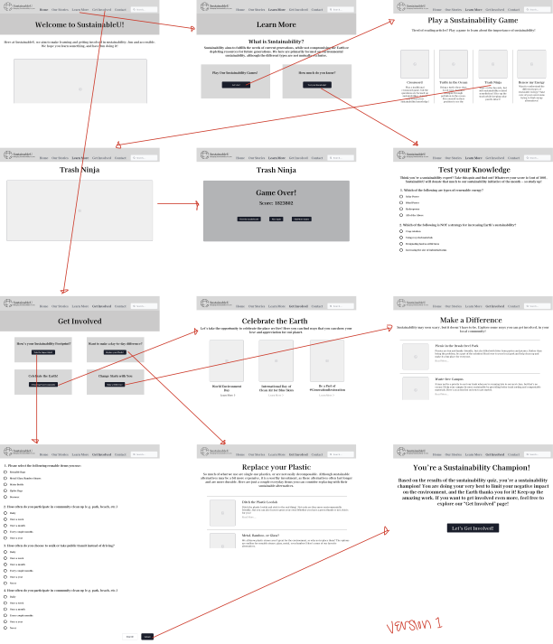
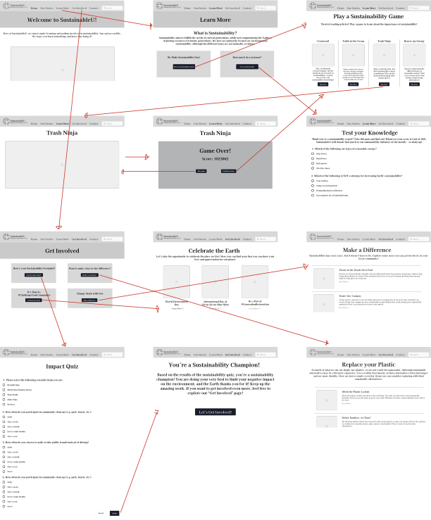
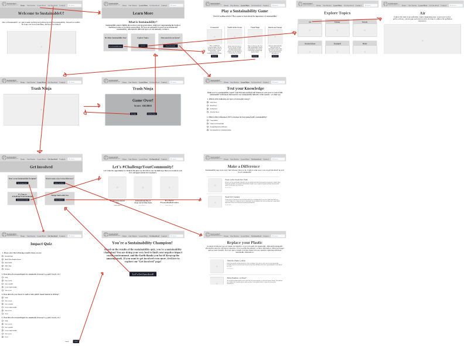
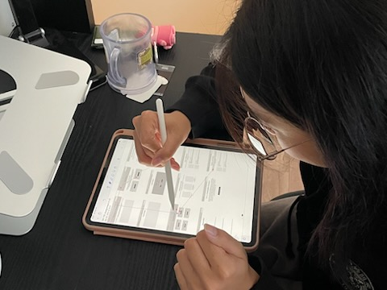
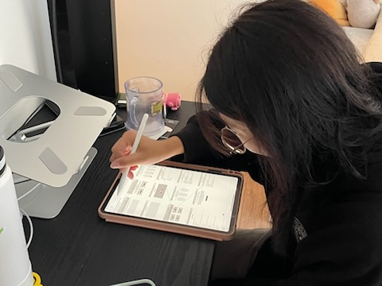
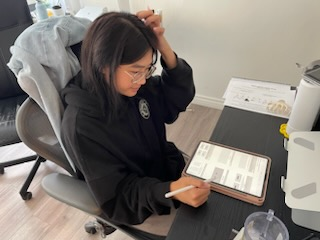

# Assignment 5: Low-Fidelity Prototype
Hanna Co | DH110 | Fall 2022

## Overview
Note: Based on feedback from the professor, I've adjusted the goals and purpose of my site to reflect that. Thus, it might differ from the scenarios outlined in the persona and usage scenarios.

### Project Description and Purpose
My current project is focused on helping college-aged individuals learn about sustainability in an accessible and engaging way. Additionally, it also helps them get involved in sustainable activities that are accessible and feasible for them.

The purpose of this low-fidelity prototype is to quickly test the functionality of a website. Doing so can help find any usability issues early on, as well as get feedback on how users expect to interact with the site. By using a low-fidelity prototype, as opposed to a high-fidelity prototype, it is not only cheaper, but since it is early on in the design process, it is still easy to make any changes and adjustments necessary. 

### User Research
Based on the results of my [user research](https://github.com/hannaco/DH110/tree/main/Assignment3), I will be focusing on two main barriers or constraints that stood out to me:
1. Engagement - most sites aren't engaging when it comes to learning about sustainability, making it seem like a chore to users, and failing to make them feel connected to the issue
2. Ways to get involved - recommended ways to get involved are often not realistic for the average person, which often discourages them

### User Personas
I created two [personas](https://github.com/hannaco/DH110/tree/main/Assignment4) centered around these barriers:
1. A female student who wants to get involved and feel encouraged that her actions are important
2. A male college student who is tired of reading through articles on sustainability 

## Tasks
1. Learn more about sustainability
2. Find ways to get involved in sustainability

## Wireframes and Wireflow
### Version 1

  

### Version 2

  

### Version 3

  

## Prototype Testing
### Version 1 Testing

  

  
  
  

### Version 2 Testing

  

## Reflection
Finally being able to take all the ideas I had and visualize them was rewarding, but also far more challenging than I thought. I struggled with finding the right amount of information to put on each page, as well as finding titles for the pages that accurately summarized the information I wanted to include on that page. Overall, the prototype testing went well, although it did take a bit of getting used to – my second testing session definitely went a lot smoother than the first. Fortunately, in both sessions, the user was able to complete both tasks with minimal frustration, which was good. However, I asked for more feedback, and in the first session, the user expressed that although the titles of the pages were clear and easy to find, it was confusing since they didn't always match the buttons, and that not every screen had a title. She also pointed out some minor things, like she didn't know where to "click", which could've been a result of the non-digital testing, but I chose to remedy that in my second prototype anyway. For the second version, I made sure the buttons matched the titles on the pages, and made sure that every page had a title. To make it more obvious where to click, I added buttons, such as on the games page, or underlining on text to indicate that it was a hyperlink. In my second testing session, the user expressed that although navigation was easy, she didn't always know what she was clicking on. She also expressed that although the interactive learning was fun, she would've also preferred a non-interactive way of learning. Thus, for my final iteration, I added a page on "Learn More" that was purely informational. Additionally, I also tried to change some buttons or titles to make it a bit more self-explanatory. Unfortunately, I did not have time to test this version, but I hope that it resolves the issues expressed to me in the first and second user tests.
